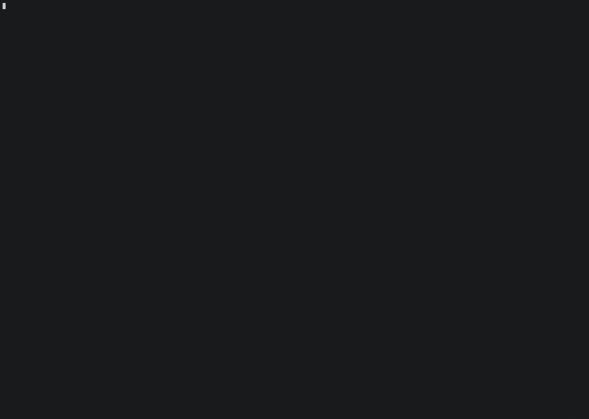

# rdfwalk

A terminal UI for browsing RDF data through a SPARQL endpoint.



## Installation

```
cargo install rdfwalk
```

## Usage

```
rdfwalk <endpoint> [start-uri]
```

If no starting URI is given, the tool opens on the Types view. If a URI is given, it opens directly on that resource in the Browser view.

## Views

### Browser

The main view. The top block shows the current resource: label (if an `rdfs:label` exists), raw URI, and `rdf:type` values right-aligned on the same line. A `★` appears when the resource is bookmarked.

Below that, the resource is broken into four sections, each a scrollable list:

- **Literal Properties**: `→ predicate = value  ^^type`
- **Outgoing Links**: `→ predicate → object`
- **Incoming Links**: `← predicate ← source`
- **As Predicate**: `subject ◆ object`

A line at the bottom of the browser shows the currently selected triple in N-Triple notation.

Navigation:
- `↑`/`↓` — move within the current section
- `Tab` / `Shift+Tab` — jump to the first item of the next/previous section
- `Enter` — follow the selected link
- `←` / `→` — go back or forward in history
- `b` — toggle bookmark on the current resource
- `c` — copy the current triple to the clipboard

### Types

Lists all distinct values of `rdf:type` found in the dataset, sorted alphabetically. Selecting a type and pressing `Enter` opens it in the Browser.

### SPARQL

A free-form SPARQL query editor. Type any SELECT query and press `Enter` to run it. Results are displayed in columns labelled with the query variable names. Pressing `Enter` on a result row navigates to the first URI found in that row.

`Tab` toggles focus between the input field and the results list.

### Search

A literal text search. Type a string and press `Enter` to find all triples whose object literal contains that string, case-insensitive. Results show the matching resource, property, and matched value. Pressing `Enter` on a result navigates to the resource.

`Tab` toggles between the input field and the results list.

### Bookmarks

Lists all bookmarked resources. Pressing `Enter` opens the resource in the Browser. Pressing `Delete` removes the bookmark. Bookmarks are stored in the OS-appropriate config directory (eg. `~/.config/rdfwalk/rdfwalk.toml` on Linux, `~/Library/Application Support/rdfwalk/rdfwalk.toml` on macOS) and persist across sessions.

## Resource display

URIs are displayed, in order of preference:
1. The value of `rdfs:label` if one exists (one arbitrary label is fetched per URI)
2. A prefixed form (`prefix:local`) if a known prefix matches
3. The full URI in angle brackets (`<http://...>`)

Built-in prefixes: `rdf`, `rdfs`, `owl`, `xsd`, `skos`, `dc`, `dct`, `foaf`, `schema`.

Literals are shown without quotes. The datatype or language tag is displayed in a separate column (e.g. `^^xsd:integer`, `@fr`). Long or multi-line values are collapsed to a single line and truncated to fit the available width.


## Keybindings

| Key | Action |
|-----|--------|
| `t` | Types view |
| `s` | SPARQL view |
| `f` | Search view |
| `m` | Bookmarks view |
| `b` | Toggle bookmark (Browser) |
| `c` | Copy current triple to clipboard (Browser) |
| `Esc` or `b` | Back to Browser (from SPARQL, Search, or Bookmarks) |
| `Delete` | Remove selected bookmark (Bookmarks view) |
| `q` | Quit |

## Known limitations

* All results are currently limited to 1000 rows per page/query (paging will be added in the future).
* Prefixes are currently limited to the mentioned built-ins.
* Full-text search is currently limited to case-insensitive partial match (uses plain `CONTAINS(LCASE(...))` clause)

## Dependencies

- [oxrdf](https://github.com/oxigraph/oxigraph) — RDF data structures
- [sparesults](https://github.com/oxigraph/oxigraph) — SPARQL result parsing
- [ratatui](https://github.com/ratatui-org/ratatui) — terminal UI
- [reqwest](https://github.com/seanmonstar/reqwest) — HTTP client
- [confy](https://github.com/rust-cli/confy) — config file management
- [arboard](https://github.com/1Password/arboard) — clipboard access
